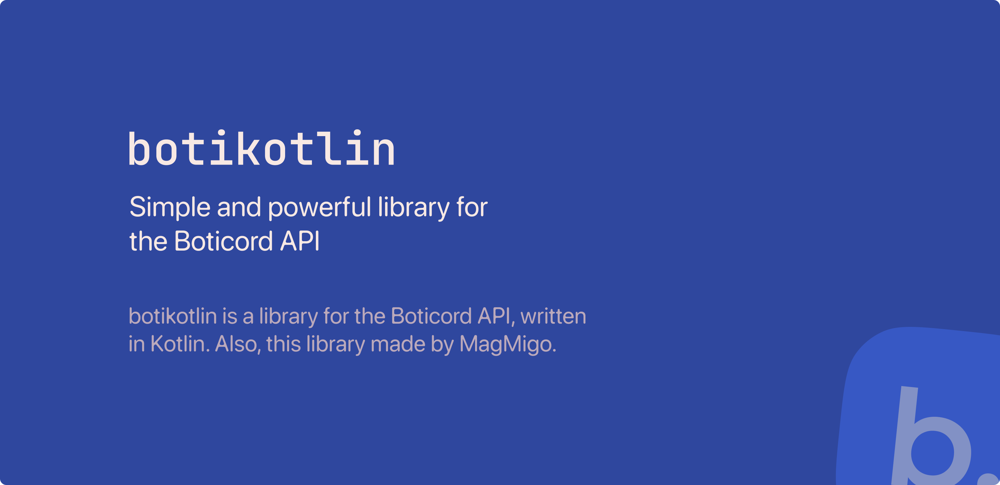

# Boticord Kotlin API wrapper.



### [Documentation](https://botikotlin.magmigo.ru)
### [Boticord Page](https://docs.boticord.top/sdk/botikotlin/)

[](https://jitpack.io/#boticord/botikotlin)

# Get started

> [!NOTE]\
> If you want to use a specific version of a library, replace the version number with a commit hash.  
> For example, instead of using `1.0-beta` (or another version), use `com.github.boticord:botikotlin:COMMIT-HASH`.


Gradle
```groovy
repositories {
    maven("https://jitpack.io")
}

dependencies {
    implementation("com.github.boticord:botikotlin:main-SNAPSHOT")
}
```

Maven:
```xml
<repositories>
    <repository>
        <id>jitpack.io</id>
        <url>https://jitpack.io</url>
    </repository>
</repositories>

<dependencies>
    <dependency>
        <groupId>com.github.boticord</groupId>
        <artifactId>botikotlin</artifactId>
        <version>main-SNAPSHOT</version>
    </dependency>
</dependencies>
```
# Example
**Update bot statistics**
```kotlin
val response = boticord(token) {
    update(BOT_ID, memberCount?, shardCount?, guildCount?)
}

logger.info(response)
```

**Get user/bot**
```kotlin
val api = boticord(token)
val response = api.fetch(USER_ID, Type.User/Bot)

logger.info(response)

// or
val response = boticord(token) {
    fetch(USER_ID, Type.User/Bot)
}

logger.info(response)
```

**Listen to boticord notifications**
```kotlin
boticord(token) {
    notifications { event ->
        logger.info("I received event!!!!! $event")
    }
}
```
